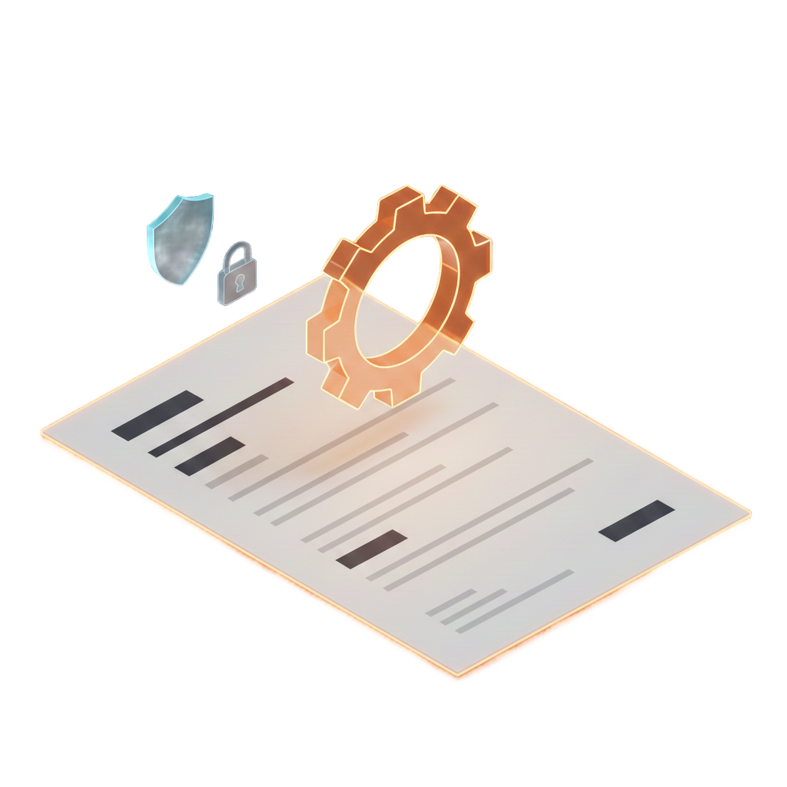

# Rustume

<!-- markdownlint-disable MD033 MD013 -->
<p align="center">

</p>

<p align="center">
A privacy-first, offline-first resume builder powered by Rust.
</p>

<!-- Badges: Build & Quality -->
<p align="center">
<a href="https://github.com/lgtm-hq/Rustume/actions/workflows/test-rust.yml?query=branch%3Amain"></a>
<a href="https://github.com/lgtm-hq/Rustume/actions/workflows/ci-lintro-analysis.yml?query=branch%3Amain"></a>
<a href="https://github.com/lgtm-hq/Rustume/actions/workflows/docker-build-publish.yml?query=branch%3Amain"></a>
</p>

<!-- Badges: Security & License -->
<p align="center">
<a href="https://github.com/lgtm-hq/Rustume/actions/workflows/scorecards.yml?query=branch%3Amain"></a>
<a href="LICENSE"></a>
</p>

<!-- Badges: Tech Stack -->
<p align="center">
<a href="https://www.rust-lang.org/"></a>
<a href="https://typst.app/"></a>
<a href="https://www.docker.com/"></a>
</p>
<!-- markdownlint-enable MD033 MD013 -->

## 🚀 Quick Start

```bash
# Build all crates
cargo build --workspace --all-features

# Run the CLI
cargo run -p rustume-cli -- parse resume.json -o rustume.json
cargo run -p rustume-cli -- render rustume.json -o resume.pdf

# Run tests
cargo test --workspace
```

## ✨ Why Rustume?

- **🔒 Privacy-First** - Your data stays on your device by default
- **📡 Offline-First** - Works 100% without internet
- **⚡ Native Performance** - Rust core with native UI shells
- **📄 Modern PDF** - Typst-based generation, no browser dependencies
- **🎨 12 Templates** - Professionally designed, customizable themes
- **📥 Import Support** - JSON Resume, LinkedIn export, Reactive Resume V3
- **🐳 Docker Ready** - Containerized server with OpenAPI docs

## 💻 CLI Usage

```bash
# Parse a JSON Resume file
rustume parse resume.json -o rustume.json

# Render to PDF
rustume render rustume.json -o resume.pdf

# Generate PNG preview
rustume preview rustume.json -o preview.png

# List available templates
rustume templates

# Create a new resume
rustume init -o my-resume.json
```

## 🐳 Docker

```bash
# Build
docker build -t rustume-server -f docker/Dockerfile .

# Run
docker run -p 3000:3000 rustume-server

# Health check
curl http://localhost:3000/health
```

Swagger UI is available at `/swagger-ui/` and the OpenAPI spec at
`/api-docs/openapi.json`.

## 🔨 Development

### Prerequisites

- **Rust** (stable) - [Install via rustup](https://rustup.rs/)
- **Python** 3.11+ with uv (for lintro)

### Setup

```bash
git clone https://github.com/lgtm-hq/Rustume.git
cd Rustume

# Build all crates
cargo build --workspace

# Run tests
cargo test --workspace

# Build CLI in release mode
cargo build -p rustume-cli --release

# Build WASM bindings
cd bindings/wasm && wasm-pack build
```

### Linting

```bash
uv run lintro chk        # Check for issues
uv run lintro fmt        # Auto-fix formatting
cargo clippy --workspace # Rust-specific lints
```

## 🙏 Acknowledgements

<!-- markdownlint-disable MD033 MD013 -->

Rustume is heavily inspired by and builds upon the work of Reactive Resume by
Amruth Pillai. The template designs in particular are adapted from Reactive
Resume's originals.

<p>
<a href="https://github.com/AmruthPillworked/Reactive-Resume"></a>
</p>

<!-- markdownlint-enable MD033 MD013 -->

## 🤝 Community

- 🐛 [Bug Reports](https://github.com/lgtm-hq/Rustume/issues/new)
- 💡 [Feature Requests](https://github.com/lgtm-hq/Rustume/issues/new)
- 📖 [Contributing Guide](CONTRIBUTING.md)

## 📄 License

MIT License - see [LICENSE](LICENSE) for details.
