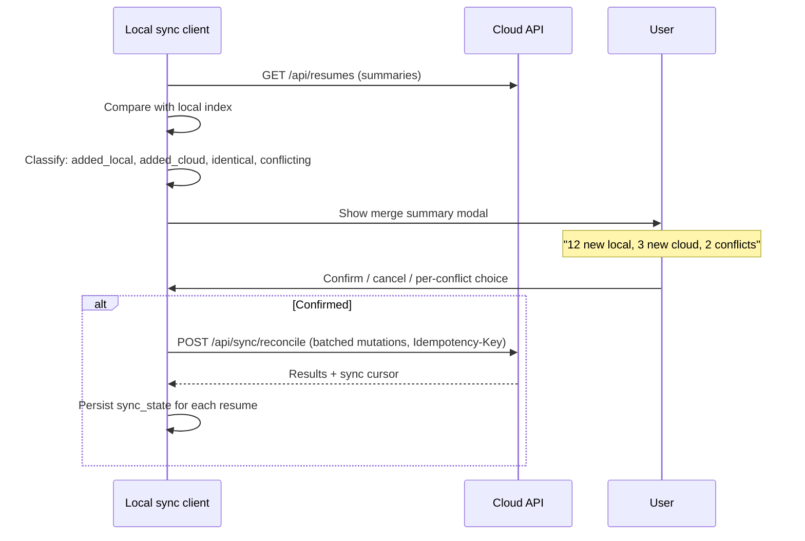
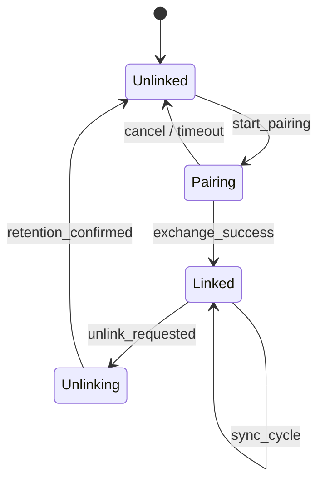

# RFC 0002: Local↔Cloud Instance Linking

| Field              | Value                                                 |
| ------------------ | ----------------------------------------------------- |
| **Title**          | Local↔Cloud Instance Linking                          |
| **Status**         | Draft                                                 |
| **Author(s)**      | Rustume maintainers                                   |
| **Date**           | 2026-07-13                                            |
| **Tracking issue** | [#338](https://github.com/lgtm-hq/Rustume/issues/338) |

## Summary

This RFC defines how a **local Rustume instance** (browser-only IndexedDB or
self-hosted Postgres per [#254](https://github.com/lgtm-hq/Rustume/issues/254))
links to a **Rustume Cloud account** for bidirectional resume sync, conflict
reconciliation, and clean unlink — replacing today's one-time, same-origin
IndexedDB→cloud import.

**Decisions at a glance:**

| Topic                | Decision                                                                                                                                  |
| -------------------- | ----------------------------------------------------------------------------------------------------------------------------------------- |
| Connection direction | Local instance is always the sync **client**; cloud is never dialed into                                                                  |
| Pairing & auth       | Short-lived pairing code + cloud-issued scoped **link token** (API-key substrate per [#85](https://github.com/lgtm-hq/Rustume/issues/85)) |
| Merge model          | **Last-write-wins (LWW) + manual resolution**; CRDT deferred                                                                              |
| Conflict detection   | `updated_at` + SHA-256 content hash + integer `version`                                                                                   |
| Ongoing sync         | Push-on-save + periodic pull; offline queue per [#42](https://github.com/lgtm-hq/Rustume/issues/42)                                       |
| Unlink               | Explicit retention choice per side; flush-or-abandon in-flight edits                                                                      |
| E2E encryption       | Ciphertext-only transport; passphrase required on both sides to link                                                                      |

## Context & goals

### Problem today

Rustume Cloud (`app.rustume.com`, WorkOS + Neon Postgres) and local/self-hosted
deployments are **independent systems** with no federation:

- Cloud mode is gated by `RUSTUME_CLOUD` + `DATABASE_URL`
  (`crates/server/src/cloud.rs`).
- Authentication is WorkOS AuthKit OAuth with HttpOnly session cookies
  (`crates/server/src/auth/workos.rs`, `crates/server/src/auth/session.rs`,
  `crates/server/src/middleware/auth.rs`).
- Resume storage uses Postgres with optimistic concurrency on an integer
  `version` column (`crates/server/src/db/migrations/001_initial.sql`,
  `crates/server/src/routes/resumes.rs`).
- The only local→cloud bridge is a **one-time import** triggered after cloud
  sign-in on the **same origin**: `CloudImportPrompt.tsx` reads IndexedDB via
  `listStoredResumeIds()` / `getStoredResume()` and POSTs to
  `/api/resumes/import` (`apps/web/src/components/Auth/CloudImportPrompt.tsx`,
  `apps/web/src/api/resumes.ts`). Local copies remain; there is no ongoing sync,
  no reverse direction, and no unlink.

### Local instance flavors

| Flavor               | Storage                                                                                                      | Sync client location         | Notes                            |
| -------------------- | ------------------------------------------------------------------------------------------------------------ | ---------------------------- | -------------------------------- |
| **(a) Browser-only** | IndexedDB (`crates/storage/src/indexeddb.rs`) + localStorage metadata (`apps/web/src/stores/persistence.ts`) | Browser tab / service worker | Origin-scoped; no server-side DB |
| **(b) Self-hosted**  | Operator's Postgres ([#254](https://github.com/lgtm-hq/Rustume/issues/254))                                  | Self-hosted server process   | Implicit single-user; behind NAT |

Both flavors MUST support the four user flows below.

### Required flows

1. **Local → Cloud link:** A local user signs up for cloud and merges both sides.
2. **Cloud → Local link:** A cloud user adopts a self-hosted instance and merges.
3. **Local unlink:** Linked local user drops the association and continues
   **local-only** (cloud copy remains unless explicitly deleted).
4. **Cloud unlink:** Linked cloud user drops the local instance and continues
   **cloud-only** (optionally wiping the local store).

Each link flow MUST handle **conflicting edits** to the same resume on both sides.

## Connection & trust

### NAT constraint — local is the sync client

**Confirmed.** A self-hosted instance is typically behind NAT, firewall, or
private network. Rustume Cloud cannot reliably initiate inbound connections to
it. Therefore:

- The **local side always initiates** pull and push to the cloud REST API
  (`/api/resumes/*`, future `/api/sync/*`).
- Cloud exposes link-management and sync endpoints; it never calls the local
  instance.
- Browser-only flavor: the browser tab (or future service worker) is the client.
- Self-hosted flavor: a background sync task in the server process is the client.

This matches how `cloudStorage.ts` already operates — the web client calls cloud,
never the reverse.

### Pairing mechanism

**Decision: short-lived pairing code exchanged for a scoped link token**, built
on the API-key infrastructure landing in [#85](https://github.com/lgtm-hq/Rustume/issues/85)
/ [#361](https://github.com/lgtm-hq/Rustume/issues/361).

Rejected for primary pairing: **WorkOS device-authorization flow alone**. WorkOS
proves human identity on the cloud account but does not give the local instance a
durable, revocable machine credential. Device flow is still used for cloud-side
login during pairing UX, not as the sync credential.

#### Pairing handshake

```mermaid
sequenceDiagram
    participant LU as Local UI
    participant LC as Local sync client
    participant CC as Cloud API
    participant CU as Cloud UI (signed in)

    alt Cloud-initiated (cloud → local link)
        CU->>CC: POST /api/link/pairing-codes
        CC-->>CU: Display code (e.g. RUST-7X4K), 10 min TTL
        LU->>LC: User enters code + cloud URL
        LC->>CC: POST /api/link/exchange {code, instance_meta}
        CC-->>LC: pending_link_id, instance_fingerprint (for confirmation)
        LC->>LU: Show fingerprint; user confirms instance
        LU->>LC: Confirm pairing
        LC->>CC: POST /api/link/confirm {pending_link_id, instance_meta}
        CC-->>LC: link_token (scoped API key), link_id, cloud_user_id
    else Local-initiated (local → cloud link)
        LU->>LC: User clicks "Link to Rustume Cloud"
        LC->>CC: POST /api/link/pairing-codes (authenticated via temp session*)
        Note over CC,CU: *Local opens cloud OAuth in browser; user signs in
        CC-->>LU: Display code for confirmation
        LC->>CC: POST /api/link/exchange {code, instance_meta}
        CC-->>LC: pending_link_id, instance_fingerprint
        LC->>LU: Show fingerprint; user confirms instance
        LU->>LC: Confirm pairing
        LC->>CC: POST /api/link/confirm {pending_link_id, instance_meta}
        CC-->>LC: link_token, link_id, cloud_user_id
    end
    LC->>LC: Store link_token securely
    LC->>CC: GET /api/sync/changes (Authorization: Bearer link_token)
```

`*` Local-initiated flow: the local UI opens `https://app.rustume.com/link/new`
which requires an existing WorkOS session (`authorize_url` in
`crates/server/src/auth/workos.rs`). After sign-in, cloud shows the pairing code;
the local instance exchanges it without holding a browser cookie.

#### Link token properties

| Property  | Value                                                                                                               |
| --------- | ------------------------------------------------------------------------------------------------------------------- |
| Format    | API key per [#85](https://github.com/lgtm-hq/Rustume/issues/85) — `rsume_link_*` prefix, stored as hash server-side |
| Scopes    | `sync:read`, `sync:write`, `link:manage` (revoke/unlink self only — no account or billing access)                   |
| Binding   | Tied to `link_id` + `instance_fingerprint` (see below)                                                              |
| Lifetime  | Long-lived until revoked or unlinked; rotatable                                                                     |
| Transport | `Authorization: Bearer <token>` on sync endpoints                                                                   |

#### Instance fingerprint

Each local instance generates a stable `instance_id` (UUID v4, created on first
run) and reports:

- `instance_type`: `browser` | `self_hosted`
- `origin` or `host` (for audit)
- `software_version`

Cloud stores `(link_id, instance_id, user_id, created_at, last_sync_at, status)`.
A link token is rejected if the fingerprint does not match the registered instance.

#### Token storage & rotation (local side)

| Flavor       | Storage                                                                                                                                                                                                                                                                                                                                                     | Rotation                                                              |
| ------------ | ----------------------------------------------------------------------------------------------------------------------------------------------------------------------------------------------------------------------------------------------------------------------------------------------------------------------------------------------------------- | --------------------------------------------------------------------- |
| Browser-only | Default: encrypted `localStorage` (or equivalent durable protected storage) so the link survives tab restarts and can drive background sync; ephemeral `sessionStorage`-only mode is an explicit opt-out that requires re-pairing after tab close. When [#44](https://github.com/lgtm-hq/Rustume/issues/44) E2E is on, wrap the credential with the E2E key | `POST /api/link/rotate` returns new token; old invalidated atomically |
| Self-hosted  | Postgres `link_credentials` table or env-sealed secret file                                                                                                                                                                                                                                                                                                 | Server admin can rotate from settings UI; audit event recorded        |

Revocation paths:

- User unlinks from either side → token invalidated immediately.
- Cloud account deletion → all link tokens for that `user_id` cascade-delete.
- Admin revokes from cloud API-keys UI (extends [#85](https://github.com/lgtm-hq/Rustume/issues/85)).

## Source of truth & merge model

### Neither side is canonical

With two independent databases (local IndexedDB/Postgres + cloud Neon Postgres),
**neither replica is the source of truth**. Every resume exists as a logical
entity identified by **UUID** (`resumes.id` in
`crates/server/src/db/migrations/001_initial.sql`), with per-replica metadata.

### Decision: LWW + manual resolution (not CRDT)

**Reject CRDT (yrs, [#40](https://github.com/lgtm-hq/Rustume/issues/40)) for v1**
cross-instance merge.

Rationale grounded in the codebase:

1. **Resume shape is hierarchical JSON**, not a flat collaborative document.
   `ResumeData` (`crates/schema/src/lib.rs`) nests `basics`, `sections[]`,
   `metadata` — mapping this to CRDTs requires field-level decomposition not
   present today.
2. **Optimistic concurrency already ships** on the integer `version` column.
   `apply_resume_update` in `crates/server/src/routes/resumes.rs` increments
   `version` and returns 409 via `ApiError::version_conflict` when
   `expected_version` mismatches. `cloudStorage.ts` blocks writes and shows a
   reload toast on conflict — this is the pattern to extend, not replace.
3. **`resume_versions` exists but has no writers** — history is planned
   ([#91](https://github.com/lgtm-hq/Rustume/issues/91)) and pairs naturally
   with manual conflict resolution, not CRDT auto-merge.
4. **CRDT remains a future upgrade path** for field-level merge if edit patterns
   demand it; the sync protocol MUST NOT preclude swapping the merge engine
   later.

**Adopt LWW + manual resolution** ([#42](https://github.com/lgtm-hq/Rustume/issues/42)
offline queue + [#43](https://github.com/lgtm-hq/Rustume/issues/43) conflict UI):

- Automatic path: if one side's edit is strictly newer and the other has no
  concurrent edit, apply LWW silently.
- Manual path: if both sides edited since last sync, surface a conflict for user
  choice (keep local, keep cloud, or per-field merge in UI).

### Conflict detection

Per-resume sync metadata (new `sync_state` table / IndexedDB store):

| Field              | Purpose                                                                       |
| ------------------ | ----------------------------------------------------------------------------- |
| `resume_id`        | UUID — global identity                                                        |
| `content_hash`     | SHA-256 of canonical JSON (see Canonicalization below)                        |
| `updated_at`       | Replica timestamp from `resumes.updated_at`                                   |
| `version`          | Integer optimistic-lock counter (per replica, not comparable across replicas) |
| `last_synced_hash` | Hash at last successful sync                                                  |
| `last_synced_at`   | Timestamp of last successful sync                                             |

**Conflict rule:** A conflict exists when `content_hash` differs on both sides
AND both `updated_at` values are **after** `last_synced_at` for that resume.

Rejected: **version vectors** for v1 — two-replica federation does not justify
the complexity; `updated_at` + content hash is sufficient with known clock-skew
mitigation (see Security).

Rejected: **version integer alone** — `version` is per-database autoincrement,
not globally meaningful across instances (local self-hosted may not have a
`version` column until #254; browser IndexedDB has no version today).

#### Canonicalization

Both Rust (`crates/schema`) and TypeScript (`apps/web`) MUST compute
`content_hash` with the same algorithm:

1. Serialize `ResumeData` to JSON with **sorted object keys** at every nesting level.
2. Use UTF-8 encoding with no insignificant whitespace (compact JSON).
3. Numbers: no trailing zeros beyond JSON spec; no locale-specific formatting.
4. Strings: standard JSON escaping (RFC 8259).
5. Hash the UTF-8 bytes with SHA-256; store lowercase hex.

Implementation ships as a shared test vector crate/module before sync lands.

#### Timestamp trust

`updated_at` is supplied by each replica. For LWW, the server records
`received_at` and rejects pushes where `updated_at` is more than ±2 minutes
ahead of server time. Clients MUST NOT treat their own `updated_at` as
authoritative for conflict resolution without a matching `content_hash` change
verified against `last_synced_hash`.

## Initial reconciliation on link

### Resume ID collisions

Resume IDs are **UUID v4** (`DEFAULT gen_random_uuid()` in
`001_initial.sql`). The import path already preserves client-supplied IDs
(`import_single_resume` in `crates/server/src/routes/resumes.rs`).

**Strategy:**

| Situation                                                           | Action                                                                                    |
| ------------------------------------------------------------------- | ----------------------------------------------------------------------------------------- |
| ID exists only on local                                             | Create on cloud (push)                                                                    |
| ID exists only on cloud                                             | Create on local (pull)                                                                    |
| ID on both, identical `content_hash`                                | No-op; record sync state                                                                  |
| ID on both, different hash, one side edited since last common point | **Conflict** — user resolves in merge summary                                             |
| ID on both, different hash, import already ran (same origin)        | Treat as conflict, not duplicate; likely LWW candidate if one side unchanged since import |

The existing import's `ON CONFLICT DO UPDATE` (`import_single_resume`) is a
**destructive LWW without confirmation** — acceptable for one-time same-origin
import but **not** for federation. First-sync MUST require explicit user
confirmation before any overwrite.

### Identity mapping

| Flavor       | Local identity                                                               | Cloud identity             |
| ------------ | ---------------------------------------------------------------------------- | -------------------------- |
| Browser-only | Implicit device user (no `user_id`)                                          | `users.id` via WorkOS link |
| Self-hosted  | Implicit single-user ([#254](https://github.com/lgtm-hq/Rustume/issues/254)) | `users.id` via pairing     |

On link, cloud records `link.user_id`. All resumes synced through that link are
stored under that `user_id` (existing `resumes.user_id` FK). Local self-hosted
gains a `cloud_user_id` column in link metadata; browser stores it in link
state only.

### First-sync merge summary UX

Before committing, the sync client computes a dry-run plan:



`POST /api/sync/reconcile` accepts an `Idempotency-Key` header and per-mutation
`operation_id` (UUID). The server stores `(link_id, operation_id) → result` for
24 h so partial batches can be retried safely after network failure.

**Summary categories shown to user:**

- **Added (local only)** — will be pushed to cloud
- **Added (cloud only)** — will be pulled to local
- **Up to date** — identical hash, skipped
- **Conflicting** — requires per-resume decision before commit

User MUST confirm before any write. Cancel returns to unlinked or
pre-reconciliation state with no mutations.

## Ongoing sync

### Cadence

| Event                      | Action                                                                                |
| -------------------------- | ------------------------------------------------------------------------------------- |
| Local save (debounced 2 s) | Push mutation to cloud if linked and online                                           |
| Periodic pull              | Every 60 s when online (self-hosted); on `visibilitychange` + 60 s interval (browser) |
| Reconnect                  | Drain offline queue, then full delta pull                                             |
| Cloud webhook (future)     | Optional push notification to local; not required for v1                              |

### Protocol (v1)

New endpoints under `/api/sync/`:

- `GET /api/sync/changes?since=<cursor>` — delta of resume summaries + hashes
- `GET /api/sync/resumes/:id` — fetch full document
- `PUT /api/sync/resumes/:id` — push with `content_hash`, `updated_at`, optional `if_hash=<expected>`
- `POST /api/sync/reconcile` — batched first-sync (idempotent)

Reuse existing validation (`validate_resume_json`, `validate_title` in
`crates/server/src/routes/resumes.rs`). Add dedicated sync rate limits
(`sync_pull_per_min`, `sync_push_per_min`) separate from one-time import and
human CRUD quotas (`import_per_min`, `resume_crud_per_min` in
`crates/server/src/config.rs`).

### Offline queue ([#42](https://github.com/lgtm-hq/Rustume/issues/42))

Extend the planned single-backend offline queue to tag mutations with `link_id`:

- Queue entries: `{operation_id, resume_id, mutation_type, payload, content_hash, base_hash, queued_at}`
- On reconnect, replay in `queued_at` order; abort batch on unrecoverable conflict
- Subscription read-only mode (`SubscriptionReadOnlyError` in `cloudStorage.ts`)
  blocks pushes but still allows queueing for post-resubscribe replay

### Conflict surfacing ([#43](https://github.com/lgtm-hq/Rustume/issues/43))

When push returns `409` or dry-run detects dual-side edits:

1. Mark resume `sync_status: conflict` in local index
2. Show notification (extend `showResumeVersionConflictToast` pattern in
   `cloudStorage.ts`)
3. Offer: **Keep local**, **Keep cloud**, **View diff** (future per-field)
4. On resolution, push winning version; record `last_synced_hash`

## Unlink lifecycle

### State machine



ASCII equivalent:

```text
                    ┌─────────────┐
         cancel     │   Pairing   │  exchange OK
    ┌──────────────►│  (10 min)   │──────────────┐
    │               └─────────────┘              │
    │                      ▲                     ▼
┌───┴────┐          start_pairing          ┌──────────┐
│Unlinked│◄───────────────────────────────│  Linked  │
└───┬────┘         retention_confirmed    └────┬─────┘
    ▲                      ▲                    │
    │               ┌──────┴──────┐             │ unlink_requested
    │               │  Unlinking  │◄────────────┘
    └───────────────┤ (confirm UX)│
                    └─────────────┘
```

### Per-side semantics

| Flow                                  | Local effect                                                                                                                                      | Cloud effect                                                                       |
| ------------------------------------- | ------------------------------------------------------------------------------------------------------------------------------------------------- | ---------------------------------------------------------------------------------- |
| **Go local-only** (unlink from local) | Revoke token locally; delete link metadata; **keep all local resumes**                                                                            | Invalidate link token; **keep cloud resumes**; link record → `unlinked`            |
| **Go cloud-only** (unlink from cloud) | Push `unlink` command with grace period; local receives on next pull (token remains valid until `unlink_ack`) → prompt to wipe or keep local copy | Schedule token revocation after `unlink_ack` or 24 h grace; **keep cloud resumes** |
| **Delete cloud account**              | Next pull fails auth → local shows "link dead"; user keeps local data                                                                             | Standard account deletion flow                                                     |

### In-flight / unsynced edits at unlink

1. **Warn** if offline queue non-empty or conflicts unresolved.
2. Offer: **Sync now then unlink** (default), **Discard unsynced local**, or
   **Cancel**.
3. When subscription is read-only, default to **Discard unsynced local** or
   **Cancel** — queued edits cannot be pushed while writes return 403; surface
   this explicitly before unlink proceeds.
4. On forced unlink with pending local edits: local mutations after
   `last_synced_at` are **not** pushed; user explicitly acknowledges loss.
5. Cloud unsynced edits similarly not pulled unless user runs final sync.

## Encryption interplay ([#44](https://github.com/lgtm-hq/Rustume/issues/44))

Per [RFC 0001 E2E encryption](../rfcs/0001-e2e-encryption.md) (proposed):

### Ciphertext-only transport

When E2E is enabled on either side, sync MUST transport **ciphertext** blobs
only — the cloud operator cannot read resume content. `resumes.data` stores
encrypted payloads; `content_hash` is computed over the **plaintext** canonical
form before encryption. Logical equality uses plaintext hash; ciphertext may
differ across re-encryption because nonces are randomized per the E2E RFC.

### Key availability

| Scenario                              | Behavior                                                                                                  |
| ------------------------------------- | --------------------------------------------------------------------------------------------------------- |
| E2E on both sides, passphrase entered | Link allowed; sync ciphertext                                                                             |
| E2E on cloud only, local plaintext    | **Block link** until local enables E2E OR user opts into plaintext export (discouraged, explicit warning) |
| E2E on local only                     | Cloud stores ciphertext; cloud UI cannot preview until passphrase entered in browser session              |
| Passphrase lost on one side           | Sync pauses for E2E resumes; plaintext metadata (title, dates) may still sync                             |

Linking does **not** transfer the passphrase over the network. User enters it
independently on each side. Optional: encrypted passphrase backup via user-held
recovery key (out of scope for v1; see E2E RFC).

## Security considerations

| Threat                    | Mitigation                                                                                                                                                                                                                                                                                |
| ------------------------- | ----------------------------------------------------------------------------------------------------------------------------------------------------------------------------------------------------------------------------------------------------------------------------------------- |
| **Link token theft**      | Scoped to `sync:read`, `sync:write`, `link:manage` only; bound to `instance_id`; rotatable; HTTPS only; never logged (callers must omit secrets/token values from `audit_events` metadata; `crates/server/src/audit/mod.rs` stores caller-provided JSON as-is and does not scrub secrets) |
| **Pairing code phishing** | Short TTL (10 min); single use; display instance fingerprint on cloud confirmation screen; rate-limit `POST /api/link/exchange` per IP                                                                                                                                                    |
| **Cross-account link**    | Exchange requires valid code tied to initiating `user_id`; code cannot be replayed across accounts                                                                                                                                                                                        |
| **Clock skew**            | Compare `updated_at` with ±2 min tolerance; prefer `content_hash` equality as tie-break                                                                                                                                                                                                   |
| **MITM during pairing**   | TLS required; optional SAS verification (show first 4 chars of `instance_id` on both screens)                                                                                                                                                                                             |

### Audit events

Extend `crates/server/src/audit/mod.rs` with:

| Event                       | When                                           |
| --------------------------- | ---------------------------------------------- |
| `link.pairing_code.created` | Code generated                                 |
| `link.exchange.success`     | Token issued                                   |
| `link.exchange.failure`     | Bad code / expired                             |
| `link.unlink.local`         | Initiated from local token                     |
| `link.unlink.cloud`         | Initiated from cloud UI                        |
| `link.token.rotated`        | Rotation                                       |
| `sync.conflict.detected`    | Conflict surfaced (resume_id only, no content) |

## Rejected alternatives

| Alternative                                               | Why rejected                                                     |
| --------------------------------------------------------- | ---------------------------------------------------------------- |
| Cloud dials into local (webhook callback, reverse tunnel) | NAT/firewall makes inbound unreliable; operator burden           |
| WorkOS device flow as sole sync credential                | No durable revocation model; session ≠ machine auth              |
| CRDT (yrs) for v1 merge                                   | Resume JSON structure, no CRDT crate, existing version-column UX |
| Version vectors                                           | Overkill for two replicas; clock + hash suffices                 |
| Global monotonic version                                  | Requires shared counter service; contradicts offline-first       |
| Same-origin import as linking                             | One-time, destructive `ON CONFLICT DO UPDATE`, no pull/unlink    |
| Manual SQL export/import                                  | Not a product feature; fails ongoing sync requirement            |

## Open questions

1. **Service worker sync for browser-only** — Should v1 require a service worker
   for background pull, or is foreground-only acceptable?
2. **Per-field merge UI** — v1 offers whole-resume choice; is diff/merge worth a
   fast-follow?
3. **Multi-device local** — Can one cloud account link multiple self-hosted
   instances? Proposal: yes, up to N (e.g. 3) with separate `link_id` each.
4. **Self-hosted without #254** — Browser-only can link before self-hosted
   Postgres ships; confirm priority order.
5. **Consolidate `docs/rfcs/` and `docs/rfc/`** — Shared numbering is documented
   in README; migrate the E2E RFC into `docs/rfc/` when convenient.

## Rollout plan

Implementation sub-issues in dependency order:

| Order | Issue title                                             | Depends on                                                     | Extends / subsumes                                                 |
| ----- | ------------------------------------------------------- | -------------------------------------------------------------- | ------------------------------------------------------------------ |
| 1     | **Pairing & trust: link tokens + exchange API**         | [#85](https://github.com/lgtm-hq/Rustume/issues/85) API keys   | New                                                                |
| 2     | **Link metadata schema** (`links`, `sync_state` tables) | #1                                                             | New                                                                |
| 3     | **Sync protocol & reconciliation engine**               | Order 1, Order 2                                               | Extends [#42](https://github.com/lgtm-hq/Rustume/issues/42)        |
| 4     | **Conflict merge UI**                                   | Order 3                                                        | Extends [#43](https://github.com/lgtm-hq/Rustume/issues/43)        |
| 5     | **Unlink lifecycle + retention UX**                     | Order 1, Order 3                                               | New                                                                |
| 6     | **Linking UI (local + cloud)**                          | Orders 1–5                                                     | Replaces `CloudImportPrompt.tsx` flow                              |
| 7     | **Self-hosted sync client**                             | [#254](https://github.com/lgtm-hq/Rustume/issues/254), Order 3 | New                                                                |
| 8     | **E2E ciphertext sync**                                 | [#44](https://github.com/lgtm-hq/Rustume/issues/44), Order 3   | Extends E2E RFC                                                    |
| —     | CRDT evaluation (deferred)                              | —                                                              | [#40](https://github.com/lgtm-hq/Rustume/issues/40) stays deferred |

Suggested issue creation after this RFC is **Accepted**.

## References

- Tracking: [#338](https://github.com/lgtm-hq/Rustume/issues/338)
- Epic: [#243](https://github.com/lgtm-hq/Rustume/issues/243) (Rustume Cloud)
- Prerequisites: [#254](https://github.com/lgtm-hq/Rustume/issues/254) (self-hosted storage)
- Related: [#40](https://github.com/lgtm-hq/Rustume/issues/40) CRDT,
  [#42](https://github.com/lgtm-hq/Rustume/issues/42) offline sync,
  [#43](https://github.com/lgtm-hq/Rustume/issues/43) conflicts,
  [#44](https://github.com/lgtm-hq/Rustume/issues/44) encryption,
  [#85](https://github.com/lgtm-hq/Rustume/issues/85) API keys
- Codebase: `crates/server/src/cloud.rs`, `crates/server/src/routes/resumes.rs`,
  `apps/web/src/stores/cloudStorage.ts`,
  `apps/web/src/components/Auth/CloudImportPrompt.tsx`
